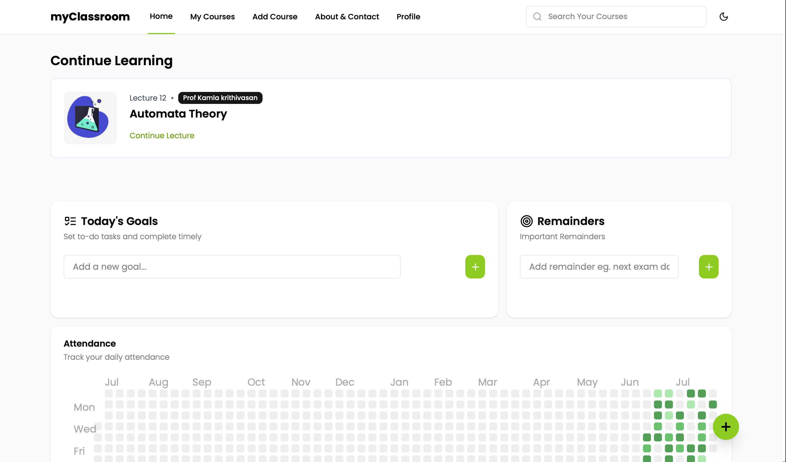
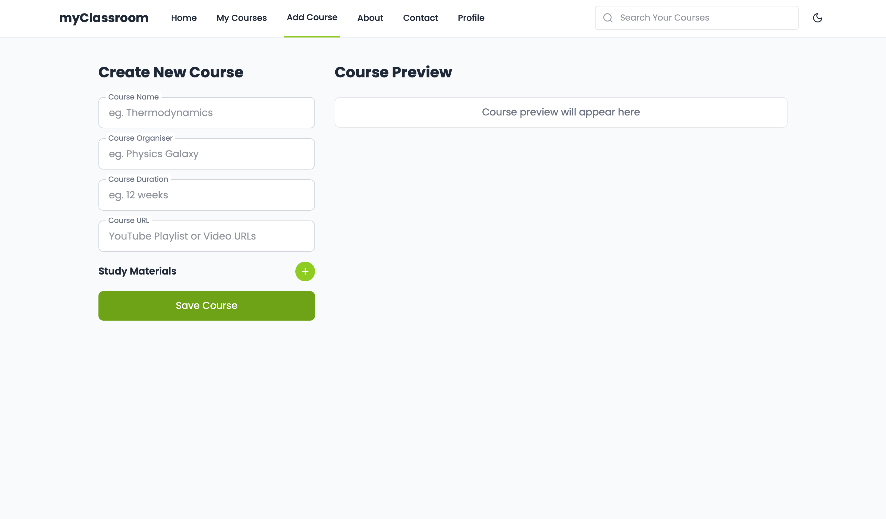
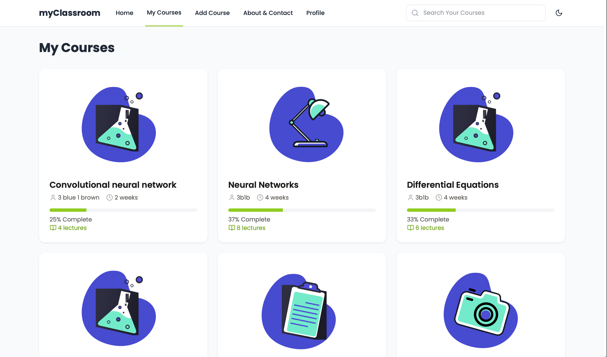
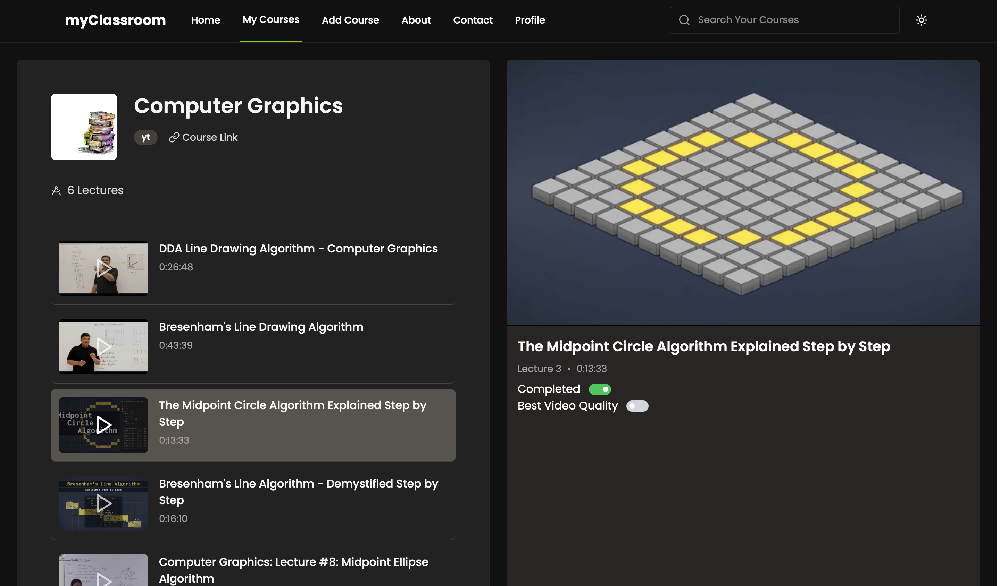

# myClassroom

### Distraction-free platform for focused selfstudy

#### webapp to create courses from youtube playlists. Design own courses, study without any ads or distractions. Track course progress, to-do, goals, study hours.

> Currently its objective is not concurrency or performance, objective is to create an application for personal use.

**tech stack**

1. `backend:`

- flask
- yt_dlp
- jwt authentication [flask_jwt_extend]
- flask_cors

2. `database:`

- mongoDB
- ORM: flask_pymongo

3. `frontend:`

- React
- TailwindCSS

